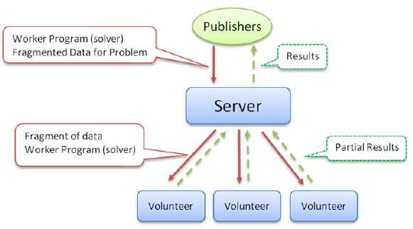
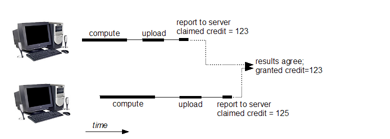
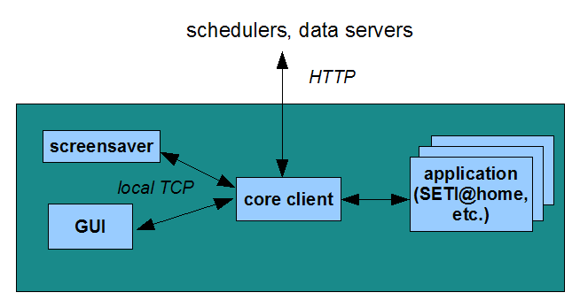

# Volunteer   computing   with   BOINC

**Joaquim Picó & Ian Palacín**

## Introduction to Volunteer Computing:

Volunteer computing is a type of distributed computing in wich people donate their computers' unused resources
to a research oriented project. This provides substantial processing power to researchers at minimal cost, 
wich makes research more affordable and efficient. This type of computing is made mostly using cloud 
distributed systems. In these systems a program is running on a volunteer's computer and periodically contacts 
the research application to request jobs and report results. The one in charge of the communication between
the volunteer program and the researchers' application is the Middleware.    

## Volunteer Computing Architecture

This picture shows the basic structure of a volunteer computing 
distributed system. We can see that on the top of the diagram we 
have the publishers/reserchers, that are the one's that need the 
computational power to perform some task. They send a fragment of 
the problem to a middle of the way server, and then the server sends 
it to a volunteer worker. When the volunteer finishes the work, it 
returns to the middle of the way server the results and then the 
server replicates this results to the publishers/researchers.

## What is BOINC

BOINC comes from Berkeley Open Infrastructure for Network Computing and is an open-source software that acts
as a middleware system for volunteer computing and greed computing. It was originally developed to support 
the SETI@home project, which purpose was to analyze radio signals. Later it became generalized as a platform
for other distributed applications. As we will see, now the applications reach from mathematics and medicine to
climatology and astrophysics. 
BOINC has been ranked as the largest computing grid in the world. As a volunteer computing platform, the
interoperability is crucial to be able to reach all the people, it supports various operating systems, 
including Windows, MacOS, Android and Linux.

## How BOINC works
### Client workflow
1. Once a client has BOINC, it starts getting tasks from the project's **scheduling server**. The taks depend on the computation power of the client.
2. The client downloads the executable and the input files from the project's **data server**.
3. The client runs the executables, producing output files.
4. The client uploads the output files tho the **data server**.
5. Later (it can take up to several days), the client reports the completed task to the **scheduling server**, and gets new tasks.
This cicle is repeated indefinitely and BOINC does it all.

### Credit

The project's server keeps track of the amount of work a client has done, this is called credit. To ensure that the credit 
is granted fairly, most BOINC projects work as follow:
* Each task is sent to **two or more** computers.
* When a computer reports a result, it claims a certain amount of credit, based on how much CPU time was used.
* When at least two results have been returned, the server compares them. If the results agree, then users are granted the smaller of the claimed credits.

### How the software works

The shcedulers and data servers are installed on computers owned and managed by the project's owner. The programs that are installed 
on the client computer are the following:
* The **core client** (or client, named boinc.exe) communicates with the external servers via **HTTP** to get and report work. This is the part
that runs and control the application.
* **Applications** are the programs that do scientific computing.
* The **GUI** is the part that provides a graphical interface. It communicates with the core client by a TCP connection. Normally is a local connection.
* The **screensaver** runs when the client is away from the computer. It also communicates whith the core client by a TCP connection.

## Examples of Volunteer Compting with BOINC

* **PrimeGrid**: A Volunteer Cloud Computing Network dedicated to find new prime numbers.
* **Minecraft@Home**: A Volunteer Cloud Computing Network dedicated to understand the fundamental laws of
Minecraft to answer unanswered questions regarding the features and true limits of the game.
* **NumberFields@home**: is a research project that uses Internet-connected computers to do research in number
theory. 
* **GPUGrid.net**: is a distributed computing infrastructure devoted to biomedical research. Thanks to the 
contribution of volunteers, GPUGRID scientists can perform molecular simulations to understand the function
of proteins in health and disease.
* **Einstein@Home**: uses your computer's idle time to search for weak astrophysical signals from spinning 
neutron stars (often called pulsars) using data from the LIGO gravitational-wave detectors, the Arecibo 
radio telescope, and the Fermi gamma-ray satellite.
* **Rosseta@Home**: By running Rosetta@home on your computer you will speed up and extend our efforts to design 
new proteins and to predict their 3-dimensional shapes. Proteins are the molecular machines and building 
blocks of life. 

## Going deeper into an example
### Introduction
Minecraft is one of the most sold computer games in the history, also one with the biggest community (perfect for volunteer computing).
The mechanics of the game can sometimes resemble to programming and that has made that a big part of the community are coders and
have computer knowledge. The game is a big world where you can create almost everything in it. This world is generated randomly by a
seed, two worlds created from the same seed are exactly identical. The possible number of different starting worlds is 
18,446,744,073,709,551,616 (2^64). 

### The problem
There is a decoration image in the menu of the game. This image whas put by a developer in the early stages of the game. 
De developer generated a random world, went to a random place and took a screenshot of a mountain, as he thought it would look cool
in the menu. This was many years ago, so everyone that has played to the game, has been seing that image in the menu every single time,
so it became a very famous image. 
Not so long ago, a curious player wanted to play in the mountain the screenshot for the image was taken. He told the community its intentions,
as he would needed help to find the exact world seed and the exact world location.

### The solution
A lot of smart people started to look at the game source code and how the pseudorandom worked in order to find a way to locate the world seed and 
the world position. After months they did it, they had a program that given a game terrain, it could identify if it was the same as the one in 
the picture or not, but they still had one problem, as we said there is around 2^64 different possible worlds, and each world has 8 times the surface
of the Earth (yes, it is that big). A normal computer would be milions of years to do that computation, even a supercomputer couldn't do the job.
They decided to open a volunteer computing project with BOINC, to see how many people would donate their computation power. The project ended having
more than 3500 people contributing, it was a success. After some months, and the 95% of all the seeds checked, they found the one that they where 
looking for.

